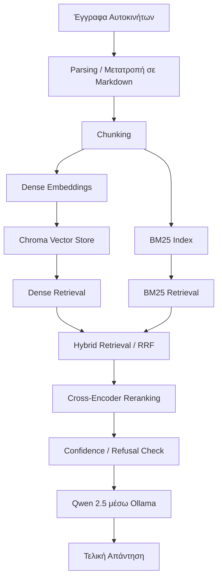

# GarageMind-RAG

Το **GarageMind-RAG** είναι ένα σύστημα Retrieval-Augmented Generation (RAG) για αναζήτηση και απάντηση ερωτήσεων πάνω σε πληροφορίες σχετικές με αυτοκίνητα.

Το έργο συνδυάζει **σημασιολογική αναζήτηση με embeddings**, **λεξιλογική αναζήτηση BM25**, **cross-encoder reranking** και ένα Large Language Model που εκτελείται τοπικά μέσω **Ollama**, με στόχο την ανάκτηση σχετικών πληροφοριών και τη δημιουργία απαντήσεων βασισμένων σε συγκεκριμένες πηγές.

Το σύστημα αναπτύχθηκε ως ακαδημαϊκό έργο, με έμφαση στην αρθρωτή αρχιτεκτονική, την τοπική εκτέλεση μοντέλων, την ποιότητα της ανάκτησης πληροφορίας και την αναπαραγωγιμότητα των αποτελεσμάτων.

---

## Περιγραφή του συστήματος

Τα παραδοσιακά Large Language Models δημιουργούν απαντήσεις βασιζόμενα κυρίως στη γνώση που απέκτησαν κατά την εκπαίδευσή τους.

Αυτό μπορεί να δημιουργήσει προβλήματα όταν μια ερώτηση απαιτεί πληροφορίες από μια συγκεκριμένη τεχνική βάση γνώσης.

Το GarageMind χρησιμοποιεί την αρχιτεκτονική Retrieval-Augmented Generation.

Πριν δημιουργηθεί η τελική απάντηση, το σύστημα:

1. αναζητά σχετικές πληροφορίες στη βάση γνώσης,
2. επιλέγει τα πιο σχετικά αποσπάσματα,
3. τα δίνει ως context στο γλωσσικό μοντέλο,
4. και στη συνέχεια δημιουργεί την τελική απάντηση.

Η συνολική διαδικασία περιλαμβάνει:

1. Εισαγωγή εγγράφων σχετικών με αυτοκίνητα
2. Ανάλυση και κανονικοποίηση του κειμένου
3. Διαχωρισμό των εγγράφων σε μικρότερα τμήματα
4. Δημιουργία embeddings
5. Δημιουργία BM25 index
6. Υβριδική ανάκτηση πληροφορίας
7. Reciprocal Rank Fusion
8. Cross-encoder reranking
9. Έλεγχο εμπιστοσύνης των αποτελεσμάτων
10. Δημιουργία απάντησης μέσω τοπικού LLM

---

## Αρχιτεκτονική



---

## Κύριες Τεχνολογίες

Η τρέχουσα υλοποίηση χρησιμοποιεί:

* **Python**
* **FastAPI**
* **Ollama**
* **Qwen 2.5 7B**
* **Hugging Face Transformers**
* **BAAI/bge-large-en-v1.5**
* **BAAI/bge-reranker-v2-m3**
* **ChromaDB**
* **BM25**
* **LlamaIndex**
* **Sentence Transformers**
* **HTML / CSS / JavaScript**

Το σύστημα μπορεί να λειτουργήσει τοπικά χωρίς να απαιτεί εμπορικό API για Large Language Model.

---

# Pipeline Ανάκτησης Πληροφορίας

Το GarageMind χρησιμοποιεί υβριδική αρχιτεκτονική ανάκτησης και δεν βασίζεται αποκλειστικά σε vector similarity.

## 1. Dense Retrieval

Τα έγγραφα μετατρέπονται σε πυκνές διανυσματικές αναπαραστάσεις χρησιμοποιώντας το μοντέλο:

```text
BAAI/bge-large-en-v1.5
```

Τα embeddings αποθηκεύονται στη βάση:

```text
ChromaDB
```

Το Dense Retrieval επιτρέπει στο σύστημα να βρίσκει αποσπάσματα που έχουν παρόμοιο νόημα με την ερώτηση, ακόμη και όταν δεν περιέχουν ακριβώς τις ίδιες λέξεις.

---

## 2. BM25 Retrieval

Παράλληλα χρησιμοποιείται BM25 για λεξιλογική αναζήτηση.

Το BM25 είναι ιδιαίτερα χρήσιμο για:

* ονόματα μοντέλων αυτοκινήτων,
* τεχνικούς όρους,
* συγκεκριμένα identifiers,
* ακριβείς λέξεις ή φράσεις.

---

## 3. Hybrid Retrieval

Τα αποτελέσματα από:

```text
Dense Retrieval
+
BM25 Retrieval
```

συνδυάζονται μέσω ranking fusion.

Έτσι το σύστημα αξιοποιεί ταυτόχρονα:

* σημασιολογική ομοιότητα,
* λεξιλογική αντιστοίχιση.

---

## 4. Cross-Encoder Reranking

Τα υποψήφια αποτελέσματα περνούν στη συνέχεια από reranking με το μοντέλο:

```text
BAAI/bge-reranker-v2-m3
```

Ο reranker εξετάζει με μεγαλύτερη ακρίβεια τη σχέση μεταξύ της ερώτησης και κάθε υποψήφιου αποσπάσματος.

Με αυτόν τον τρόπο βελτιώνεται η τελική επιλογή context.

---

## 5. Έλεγχος Εμπιστοσύνης

Πριν από τη δημιουργία της απάντησης εφαρμόζεται ένα confidence threshold.

Αν τα αποτελέσματα της ανάκτησης έχουν πολύ χαμηλή σχετικότητα, το σύστημα μπορεί να αποφύγει τη δημιουργία μιας μη τεκμηριωμένης απάντησης.

Ο στόχος είναι η μείωση των hallucinations.

---

## 6. Δημιουργία Απάντησης

Το τελικό context δίνεται στο γλωσσικό μοντέλο:

```text
Qwen 2.5 7B
```

το οποίο εκτελείται τοπικά μέσω:

```text
Ollama
```

Το μοντέλο χρησιμοποιεί τα ανακτημένα αποσπάσματα για να δημιουργήσει την τελική απάντηση.

---

# Τρέχουσα Ρύθμιση Retrieval

Η βασική πειραματική ρύθμιση του συστήματος είναι:

| Παράμετρος                   |                    Τιμή |
| ---------------------------- | ----------------------: |
| Μέγεθος chunk                |              500 tokens |
| Επικάλυψη chunks             |               60 tokens |
| Dense retrieval candidates   |                      20 |
| BM25 candidates              |                      20 |
| Τελικά reranked αποτελέσματα |                       5 |
| Refusal threshold            |                    0.15 |
| Embedding model              |  BAAI/bge-large-en-v1.5 |
| Reranker                     | BAAI/bge-reranker-v2-m3 |
| Generation model             |             Qwen 2.5 7B |

Οι τιμές αυτές μπορούν να αλλάξουν μέσω του configuration του project.

---

# Δομή του Repository

```text
GarageMind-RAG/
│
├── app/
│   ├── generate/
│   │   └── answer.py
│   │
│   ├── ingest/
│   │   ├── build_index.py
│   │   ├── bundle_pdf.py
│   │   ├── crawl.py
│   │   ├── manifest.py
│   │   ├── parse_html.py
│   │   ├── run.py
│   │   └── to_markdown.py
│   │
│   ├── retrieval/
│   │   ├── citations.py
│   │   ├── hybrid.py
│   │   ├── metadata.py
│   │   └── rerank.py
│   │
│   ├── api.py
│   ├── config.py
│   └── ui.py
│
├── data/
│   ├── manuals/
│   ├── models_manifest.csv
│   ├── models_manifest.json
│   ├── variants_manifest.csv
│   └── variants_manifest.json
│
├── eval/
│   ├── derive_gold.py
│   ├── questions.jsonl
│   ├── run_ir.py
│   └── run_ragas.py
│
├── scripts/
│   ├── crawl_full_site.py
│   └── rag_smoke.py
│
├── web/
│   ├── assets/
│   ├── API.md
│   ├── app.js
│   ├── index.html
│   └── styles.css
│
├── requirements.txt
├── Makefile
├── .gitignore
└── README.md
```

---

# Dataset Αυτοκινήτων

Το repository περιλαμβάνει ένα ελαφρύ automotive seed corpus.

Τα δεδομένα οργανώνονται ιεραρχικά με βάση:

```text
κατασκευαστής/
    μοντέλο/
        τύπος-αμαξώματος/
            εύρος-ετών/
                model-overview.md
```

Παράδειγμα:

```text
data/manuals/
└── ford/
    └── focus/
        └── 4-door/
            └── 2018-2025/
                └── model-overview.md
```

Το τρέχον public seed dataset περιλαμβάνει περίπου:

* **130 διαφορετικά μοντέλα αυτοκινήτων**
* **274 model / variant / year documents**
* **5 κατασκευαστές**

Οι κατασκευαστές είναι:

* Ford
* Honda
* Toyota
* Volvo
* Volkswagen

Το corpus παρήγαγε περίπου:

```text
274 documents
      ↓
822 indexed chunks
```

---

## Σημαντική Σημείωση για το Dataset

Τα αρχεία:

```text
model-overview.md
```

που περιλαμβάνονται στο δημόσιο repository αποτελούν κυρίως μια δομημένη βάση δεδομένων μεταδεδομένων και συμβατότητας οχημάτων για ανάπτυξη και δοκιμή του συστήματος.

Δεν αποτελούν πλήρη επίσημα owner manuals των κατασκευαστών.

Η αρχιτεκτονική του συστήματος υποστηρίζει την εισαγωγή και ευρετηρίαση μεγαλύτερων και πληρέστερων τεχνικών εγχειριδίων, όταν αυτά είναι νόμιμα διαθέσιμα.

---

# Indexed Corpus

Ένα αντιπροσωπευτικό build του index παρήγαγε:

| Κατασκευαστής | Documents |  Chunks |
| ------------- | --------: | ------: |
| Ford          |        83 |     249 |
| Honda         |        19 |      57 |
| Toyota        |        78 |     234 |
| Volvo         |         4 |      12 |
| Volkswagen    |        90 |     270 |
| **Σύνολο**    |   **274** | **822** |

Τα indexes που δημιουργούνται από το σύστημα δεν αποθηκεύονται στο Git repository.

Δημιουργούνται τοπικά από τα αρχικά έγγραφα.

---

# Εγκατάσταση

## 1. Clone του Repository

```bash
git clone https://github.com/artopodama/GarageMind-RAG.git
cd GarageMind-RAG
```

---

## 2. Δημιουργία Python Virtual Environment

### Windows PowerShell

```powershell
python -m venv .venv
.venv\Scripts\Activate.ps1
```

### Linux / macOS

```bash
python3 -m venv .venv
source .venv/bin/activate
```

---

## 3. Εγκατάσταση Dependencies

```bash
pip install -r requirements.txt
```

---

# Ρύθμιση Ollama

Το GarageMind χρησιμοποιεί αυτή τη στιγμή το Qwen ως τοπικό Large Language Model μέσω Ollama.

Κατεβάστε το μοντέλο:

```bash
ollama pull qwen2.5:7b
```

Μπορείτε να επιβεβαιώσετε ότι έχει εγκατασταθεί με:

```bash
ollama list
```

Το OpenAI-compatible endpoint του Ollama είναι συνήθως:

```text
http://localhost:11434/v1
```

---

# Configuration

Δημιουργήστε ένα αρχείο:

```text
.env
```

στο root directory του project.

Παράδειγμα:

```env
DEEPSEEK_BASE_URL=http://localhost:11434/v1
DEEPSEEK_API_KEY=ollama

GEN_MODEL=qwen2.5:7b
REASON_MODEL=qwen2.5:7b

EMBED_MODEL=BAAI/bge-large-en-v1.5
RERANKER=BAAI/bge-reranker-v2-m3

CHUNK_TOKENS=500
CHUNK_OVERLAP=60

TOP_K_DENSE=20
TOP_K_BM25=20
TOP_K_RERANK=5

REFUSAL_SCORE=0.15
```

Το πραγματικό αρχείο `.env` δεν πρέπει να αποθηκεύεται στο Git repository.

Για αυτόν τον λόγο περιλαμβάνεται στο `.gitignore`.

---

# Δημιουργία του Retrieval Index

Τα έγγραφα που βρίσκονται στο project μπορούν να μετατραπούν σε retrieval index τοπικά.

Παράδειγμα:

```bash
python -m app.ingest.build_index --brands ford,honda,toyota,volvo,vw
```

Η διαδικασία indexing είναι:

```text
Markdown documents
        ↓
Document parsing
        ↓
Chunking
        ↓
BGE embeddings
        ↓
ChromaDB
        +
BM25 index
```

Τα indexes που δημιουργούνται αποθηκεύονται τοπικά στους αντίστοιχους φακέλους δεδομένων και δεν ανεβαίνουν στο GitHub.

---

# Εκτέλεση του API

Για την εκκίνηση του FastAPI backend:

```bash
uvicorn app.api:app --reload
```

Το API είναι διαθέσιμο στη διεύθυνση:

```text
http://127.0.0.1:8000
```

Το αυτόματο FastAPI documentation είναι διαθέσιμο στη διεύθυνση:

```text
http://127.0.0.1:8000/docs
```

---

# Web Interface

Το project περιλαμβάνει ένα lightweight frontend στον φάκελο:

```text
web/
```

Το frontend επικοινωνεί με το backend του GarageMind και επιτρέπει στον χρήστη να:

* υποβάλλει ερωτήσεις,
* επιλέγει στοιχεία οχήματος,
* λαμβάνει απαντήσεις,
* και βλέπει τις πληροφορίες που επιστρέφει το σύστημα.

Η διεπαφή έχει υλοποιηθεί με:

* HTML
* CSS
* JavaScript

---

# Αξιολόγηση του Συστήματος

Το repository περιλαμβάνει ξεχωριστό evaluation pipeline στον φάκελο:

```text
eval/
```

Περιλαμβάνονται τα αρχεία:

```text
derive_gold.py
questions.jsonl
run_ir.py
run_ragas.py
```

---

## Αξιολόγηση Retrieval

Το retrieval pipeline μπορεί να αξιολογηθεί μέσω Information Retrieval metrics όπως:

* Recall@K
* Mean Reciprocal Rank
* nDCG

Οι μετρικές αυτές χρησιμοποιούνται για να αξιολογηθεί αν τα σωστά αποσπάσματα βρίσκονται στις πρώτες θέσεις των αποτελεσμάτων.

---

## Αξιολόγηση RAG

Το project περιλαμβάνει επίσης μηχανισμό αξιολόγησης του τελικού RAG pipeline.

Η αξιολόγηση μπορεί να εξετάσει ξεχωριστά:

```text
Retrieval Quality
        +
Generation Quality
```

και να χρησιμοποιήσει μετρικές σχετικές με:

* Faithfulness
* Answer Relevancy
* Context Precision
* Context Recall

---

# Βασικοί Στόχοι Σχεδιασμού

## Τοπική Εκτέλεση

Το γλωσσικό μοντέλο μπορεί να εκτελείται τοπικά μέσω Ollama.

Με αυτόν τον τρόπο μειώνεται η εξάρτηση από εξωτερικά εμπορικά APIs.

---

## Grounded Generation

Οι απαντήσεις δημιουργούνται με βάση το context που ανακτάται από τη βάση γνώσης.

Ο στόχος είναι να μειωθεί η πιθανότητα δημιουργίας πληροφοριών που δεν υπάρχουν στις πηγές.

---

## Hybrid Retrieval

Το σύστημα συνδυάζει:

```text
Dense Semantic Retrieval
+
BM25 Lexical Retrieval
```

ώστε να αξιοποιεί τα πλεονεκτήματα και των δύο τεχνικών.

---

## Reranking

Ένα ξεχωριστό Cross-Encoder μοντέλο χρησιμοποιείται για την επαναξιολόγηση των αποτελεσμάτων και τη βελτίωση της τελικής επιλογής context.

---

## Refusal Mechanism

Όταν η ανάκτηση πληροφορίας δεν επιστρέφει αποτελέσματα επαρκούς ποιότητας, το σύστημα μπορεί να αποφεύγει τη δημιουργία μη τεκμηριωμένης απάντησης.

---

## Αναπαραγωγιμότητα

Οι generated vector databases και τα indexes δεν αποθηκεύονται στο repository.

Μπορούν να δημιουργηθούν ξανά από το dataset μέσω του indexing pipeline.

---

# Περιορισμοί

Η τρέχουσα έκδοση του GarageMind έχει ορισμένους περιορισμούς:

* Το δημόσιο dataset αποτελεί lightweight development corpus και όχι πλήρη συλλογή επίσημων εγχειριδίων αυτοκινήτων.
* Η ποιότητα του retrieval εξαρτάται άμεσα από την ποσότητα και την ποιότητα των διαθέσιμων εγγράφων.
* Η ταχύτητα του συστήματος εξαρτάται από το διαθέσιμο CPU ή GPU.
* Η τρέχουσα βάση δεδομένων περιλαμβάνει περιορισμένο αριθμό κατασκευαστών.
* Τεχνικές προδιαγραφές μπορεί να διαφέρουν ανάλογα με το model year, την αγορά, τον κινητήρα και την έκδοση του οχήματος.
* Οι απαντήσεις που δημιουργούνται αυτόματα δεν πρέπει να αντικαθιστούν την επίσημη τεχνική τεκμηρίωση του κατασκευαστή σε περιπτώσεις που σχετίζονται με ασφάλεια ή συντήρηση.

---

